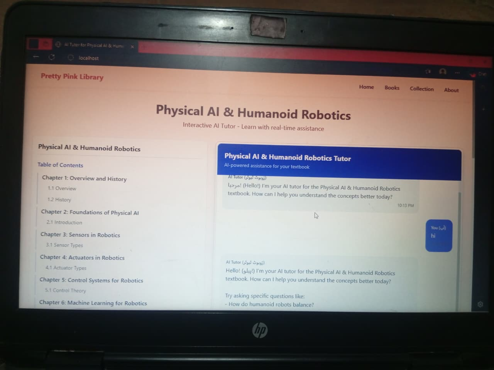

📘 Physical AI & Humanoid Robotics

AI-Native Textbook • Multi-Agent System • Robotics Learning Platform

A modern, AI-powered textbook project focused on Physical AI, Humanoid Robotics, and Embodied Intelligence.
This repository includes the complete book structure, chapters, diagrams, agent workflows, tutorials, and automation tools used to build and maintain the textbook.

Built with: Next.js, TailwindCSS, Docusaurus, Claude Code, Qwen, and OpenAI Agents.

The Physical AI & Humanoid Robotics Textbook Project is a fully automated learning system designed to help students master:

🤖 Humanoid Robotics

🧠 Embodied & Physical AI

⚙️ Actuators, Sensors & Mechatronics

🦾 Locomotion, Balance & Movement

🪫 Energy Systems & Power Design

🧩 Robotics Algorithms & Control

💡 Intelligent Agents & Cognitive Models

The project uses AI agents to generate, update, and maintain textbook content such as chapters, examples, diagrams, and practice exercises.

📂 Repository Structure
📁 physical-ai-humanoid-robotics/
│
├── 📘 docs/                # Docusaurus book chapters
├── 🌐 website/             # Next.js + TailwindCSS website
├── 🤖 agents/              # Claude/Qwen agent configs & skills
├── 🧠 workflows/           # Automated writing and generation flows
├── 📊 assets/              # Book diagrams, images, figures
└── README.md               # Project overview

✨ Key Features
🔹 1. AI-Native Textbook

Every chapter is generated and maintained by AI agents with clear specifications.

🔹 2. Multi-Agent Writing System

Uses Claude Code, Qwen, and helper subagents for:

Chapter writing

Illustration generation

Example problems

Urdu/English translations

Updating and maintaining content

🔹 3. Complete Robotics Curriculum

From basics of actuators to advanced humanoid locomotion.

🔹 4. Hands-on Tutorials

Code examples, simulations, and hardware notes.

🔹 5. Next.js Website

📘 Chapters Included

✔ Introduction to Physical AI
✔ Humanoid Robotics Architecture
✔ Sensors, Actuators & Control
✔ Motion Planning & Locomotion
✔ Safety, Ethics & Future of Embodied AI
✔ Labs, Tutorials & Sample Projects

🛠 Tech Stack

Next.js + TailwindCSS — website

Docusaurus — textbook platform

Claude Code / Qwen / OpenAI — multi-agent writing

TypeScript — core codebase

GitHub Actions — automation

# Run both at the same time (in root directory)
concurrently "npm run dev" "cd Physical-AI-Humanoid-Robotics && npm run start"

🌐 View the Textbook Online
The textbook is deployed to GitHub Pages and can be viewed at:
https://vandanachohan.github.io/Physical-AI-Humanoid-Robotics/

video tutorials/Examples
<video controls src="Physical AI & Humanoid Robotics - Textbook - Personal - Microsoft​ Edge 2025-12-18 13-13-57.mp4" title="book"></video>
